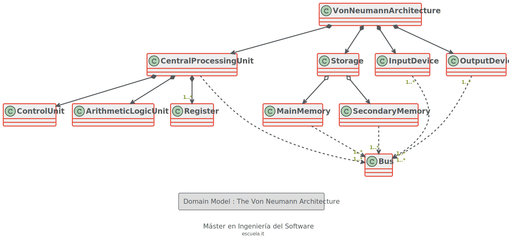

# Práctica 1 : Modelo del Dominio
EscuelaIT - Curso de Modelado Orientado a Objetos

Docente : Luis Fernández

## Index

* [The von Neumann architecture](#Von_Neumann_Architecture)
* [Domain Model](#Domain_Model)

## Von_Neumann_Architecture

[WIKIPEDIA](https://es.wikipedia.org/wiki/Arquitectura_de_Von_Neumann)

[YOUTUBE](https://www.youtube.com/watch?v=8gc_-CxjguQ)

## Domain_Model
